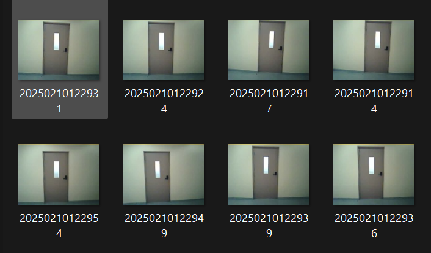
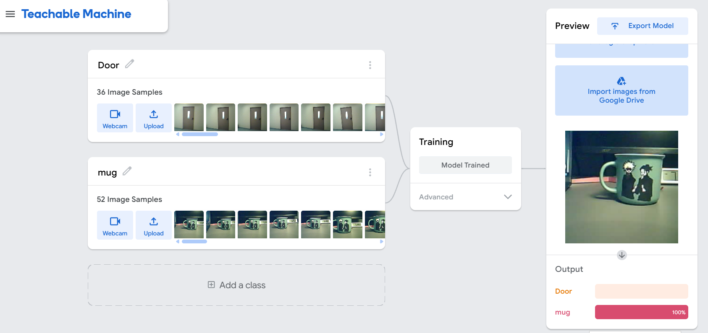

# Mug & Door Object Recognition Project

This project uses a **Keras model** to recognize objects (Mug or Door) in images.

---

## 📌 Collected Samples

I collected sample images of mug and door for training:

- **Mug Sample**
  

- **Door Sample**
  

---

## 📌 Uploaded Samples to Training Site

I uploaded the collected images to the training website:



---

## 📌 Generated Code and Tested

I used the generated code from the site, and tested it on Google Colab:

- First code test:
  

- Final code test:
  

---

## 📌 Final Code Used

```python
from keras.models import load_model
from PIL import Image, ImageOps
import numpy as np

np.set_printoptions(suppress=True)

model = load_model("keras_model.h5", compile=False)
class_names = [line.strip() for line in open("labels.txt", "r").readlines()]

data = np.ndarray(shape=(1, 224, 224, 3), dtype=np.float32)
image = Image.open("mug.jpg").convert("RGB")
size = (224, 224)
image = ImageOps.fit(image, size, Image.Resampling.LANCZOS)
image_array = np.asarray(image)
normalized_image_array = (image_array.astype(np.float32) / 127.5) - 1
data[0] = normalized_image_array

prediction = model.predict(data)
index = np.argmax(prediction)
class_name = class_names[index]
confidence_score = prediction[0][index]

label = class_name.strip().split(' ', 1)[-1]
if confidence_score > 0.5:
    print(f"✅ Detected Object: {label} (Confidence: {confidence_score:.2f})")
else:
    print("❌ Object not recognized with sufficient confidence.")
