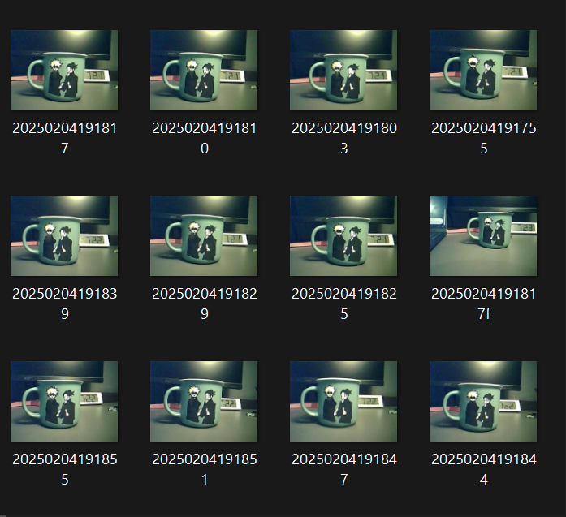

# Mug & Door Object Recognition with Keras Model

This project uses a **Keras model** to recognize objects in images, specifically:
- **Mug**
- 
- **Door**
- 

The model is loaded in Python, processes the image, and predicts the object with confidence score.

---

## 📌 Example Test Code Output
The code processes an image of a mug and outputs:

